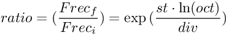
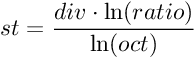

# About

External for Windows version of Max 8 (Max/MSP). Custom versions of the very well known _ftom_ and _mtof_ objects. It is possible to change the central 'A4' MIDI note, the tuning frequency of the central 'A4' note, the number of divisions of an octave, and the ratio of the octave. 
This project contains, in addition, the prebuilt externals in .mxe64 format and a help file for each one.
Related: [12 equal temperament](https://en.wikipedia.org/wiki/12_equal_temperament)

### mtof formula

### ftom formula

## Ratio

From the previous, you can obtain a new formula for difference in semitones and frequency ratio

### st to ratio

### ratio to st

------------------------------------------------------

# Versions History

- Commented out the infinite value restrictions
- Default reference frequency and midi note are now midi0=60 and f0=261.625565300598 (instead of A4=440 and f0=440)
